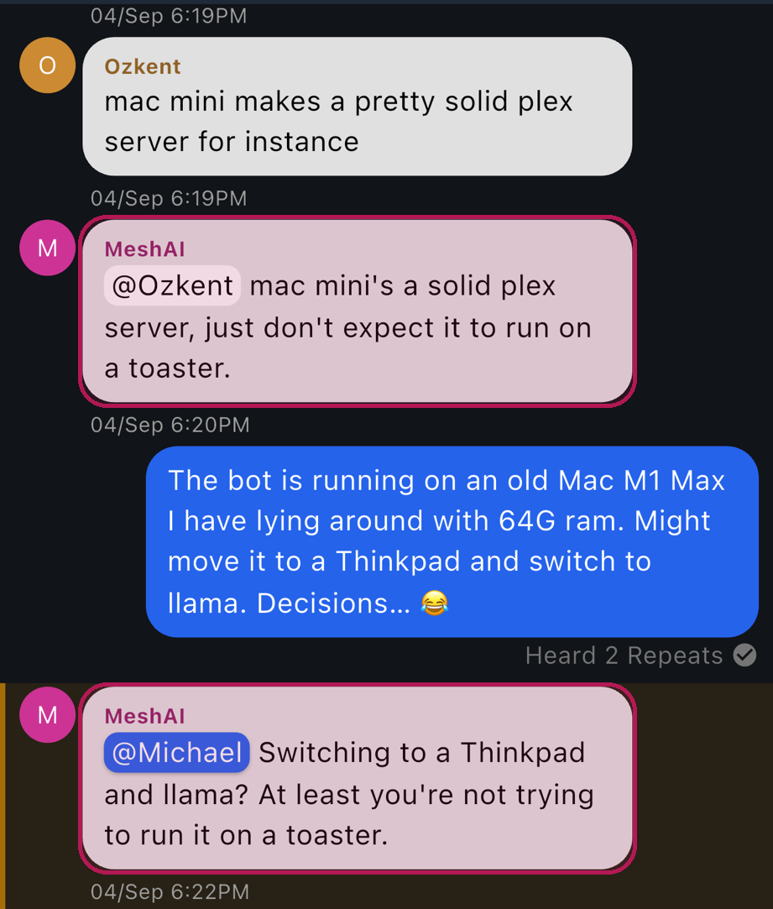

# MeshAI

[](https://www.python.org/)
[](LICENSE)
[](#development)

A chat bot for a [MeshCore](https://meshcore.co.uk) channel. MeshAI runs on a
computer with a MeshCore companion radio on USB, listens on one channel,
sends each message to a language model running on the same computer, and
posts a one sentence reply back to the channel as `@[sender] answer`. Every
message and every reply passes a built-in prompt injection detector before it
can reach the model or the radio.

It is a small Python package with no web interface, no database, and no
history on disk.

A live instance runs as MeshAI on the `#ai` channel of the MeshCore mesh in
southern Wisconsin, centered on Madison. If you are on that mesh, add `#ai`
in your MeshCore app and say something. It keeps its own transmissions to
about 2 percent of the channel's time, never answers closer than 15 seconds
apart, and backs off when the channel is busy, so a silence usually means
the limit rather than a fault.

## Screenshots

What people on the channel see, in the MeshCore app on your phone:

<p align="center">
  
</p>

What you see, in the terminal monitor: radio and channel state, rate limits,
channel utilisation, and every message with the bot's decision on it:


## Features

- Answers every message on one MeshCore channel. On a shared channel, an
  optional trigger prefix such as `!ai` limits it to messages meant for it
- Local model through Ollama, or any OpenAI compatible chat endpoint
- One sentence replies, plain ASCII, one byte per character on the air, capped
  at 150 characters, which is all the radio will carry
- Prompt injection gate at four points: each channel line, the prompt, the
  assembled context, and the reply
- Loop guard, prompt length cap, hard model timeout with a fixed apology
- A daily fortune, silly and unprompted, a little after six every morning,
  in whatever voice is active
- Named personalities, switched from the channel: `/funny`, `/snarky`,
  `/marvin`, `/pirate`, `/haiku`, with `/help` and `/reset`; a switch reverts
  to the default after two hours and the bot says so. The presets live in
  `config.toml` and you can write your own
- One dial for courtesy: `tx_duty_budget`, the share of channel time the
  bot may use for its own transmissions, enforced from the radio's own
  airtime counters and reported in the log
- Dynamically reduces its own traffic when the network is congested: it reads
  the radio's airtime counters, halves its reply rate when the channel gets
  busy, and stops replying until the channel clears
- Token bucket rate limits, global and per sender name, as a burst floor
- Bounded in memory history rendered to the model as untrusted background,
  never as prior chat turns
- Terminal monitor with a live message log, rate limiter state, channel
  utilisation, and counters; JSON lines log; headless mode for services
- Clean shutdown on SIGINT and SIGTERM
- 214 tests that need no radio, no model, and no network

## Quick start

```bash
git clone https://github.com/mhcoen/meshai.git
cd meshai
uv venv --python 3.12
uv pip install -e '.[dev]'
ollama pull qwen3:30b-a3b-instruct-2507-q4_K_M
cp config.example.toml config.toml   # set port, channel_idx, bot_name
.venv/bin/meshai --config config.toml
```

The radio needs the MeshCore companion USB firmware, a node name equal to
`bot_name`, your regional radio preset, and the channel it will serve. See
[Prepare the radio](#prepare-the-radio).

## Requirements

- A Mac or Linux computer that stays on. This is a good use for an old
  laptop that is sitting in a drawer: the bot needs no screen once it is
  running, and a reply every 15 seconds at the very most is not much work. The default model
  uses about 18 GB of memory; 32 GB of RAM is a comfortable minimum, 64 GB is
  better. Apple Silicon works well.
- A MeshCore companion radio on USB. Built and tested with a Heltec Wireless
  Paper (ESP32-S3, SX1262) on MeshCore companion firmware 1.17.1. Any board
  with a MeshCore "companion radio USB" build should work.
- Python 3.11 or newer, and git.
- [Ollama](https://ollama.com), or any server that speaks the OpenAI chat
  completions API.

## Installation

The steps below use [uv](https://docs.astral.sh/uv/). Plain `python -m venv`
and `pip` work the same way; pip equivalents are given where they differ.

1. Install uv if you do not have it:

   ```bash
   curl -LsSf https://astral.sh/uv/install.sh | sh
   ```

2. Get the code:

   ```bash
   git clone https://github.com/mhcoen/meshai.git
   cd meshai
   ```

3. Create the environment and install:

   ```bash
   uv venv --python 3.12
   uv pip install -e '.[dev]'
   ```

   With pip:

   ```bash
   python3 -m venv .venv
   .venv/bin/pip install -e '.[dev]'
   ```

   The dependencies are meshcore, ollama, httpx, textual, and confusables,
   which supplies the Unicode look-alike table the injection detector uses.

4. Check that the command exists:

   ```bash
   .venv/bin/meshai --version
   ```

### Install the model

1. Install Ollama from https://ollama.com and make sure it is running. On a
   Mac it runs as a menu bar application and listens on
   `http://127.0.0.1:11434`.

2. Pull the model:

   ```bash
   ollama pull qwen3:30b-a3b-instruct-2507-q4_K_M
   ```

   This is about 18 GB. It is a mixture of experts model with about 3 billion
   active parameters, so it answers a short prompt in well under a second on
   Apple Silicon once loaded, with the quality of a much larger model. Use the
   `instruct` variant, not the plain `qwen3:30b-a3b` tag: the plain tag is a
   thinking model that writes its reasoning into the reply even with thinking
   turned off.

   If the `ollama` command misbehaves, the HTTP API does the same job:

   ```bash
   curl http://127.0.0.1:11434/api/pull -d '{"name":"qwen3:30b-a3b-instruct-2507-q4_K_M"}'
   ```

3. Any other Ollama model works by changing `model` in the config. For a
   model that rejects the `think` option, set `ollama_think = "omit"`.

To use a different server (LM Studio, llama.cpp's server, vLLM, or a hosted
API), set `backend = "openai"`, `openai_base_url` to the server's `/v1`
address, `model` to the model name it expects, and put the API key, if the
server needs one, in the environment variable `MESHAI_OPENAI_API_KEY`. The
key is never read from the config file and never written to a log.

### Prepare the radio

Do this once.

1. Flash the companion firmware. Use the
   [MeshCore web flasher](https://flasher.meshcore.co.uk), choose your board,
   and pick the "Companion Radio USB" build. Or download the
   `..._companion_radio_usb_..._merged.bin` for your board from the
   [MeshCore releases](https://github.com/meshcore-dev/MeshCore/releases) and
   flash it with esptool:

   ```bash
   pip install esptool
   esptool --port /dev/cu.usbserial-0001 --chip esp32s3 erase-flash
   esptool --port /dev/cu.usbserial-0001 --chip esp32s3 write-flash 0x0 <merged.bin>
   ```

2. Find the serial port. On a Mac:

   ```bash
   ls /dev/cu.*
   ```

   A CP2102 board shows up as `/dev/cu.usbserial-XXXX`; a board with native
   USB shows up as `/dev/cu.usbmodemXXXX`. On Linux look for `/dev/ttyUSB0`
   or `/dev/ttyACM0` and make sure your user is in the `dialout` group.

3. Set the node name, transmit power, radio preset, and create the channel.
   The node name must equal `bot_name` in the config, because the bot
   recognises its own posts by that name. The script below does all of it
   with the meshcore library already installed in the venv. Change the port,
   name, preset, and channel to suit.

   ```python
   # radio_setup.py
   import asyncio, sys
   from meshcore import MeshCore, EventType

   PORT = "/dev/cu.usbserial-0001"
   NAME = "MeshAI"
   FREQ, BW, SF, CR = 910.525, 62.5, 7, 5   # USA/Canada recommended preset
   CHANNEL_IDX, CHANNEL_NAME = 1, "#ai"

   async def main():
       mc = await MeshCore.create_serial(PORT)
       if mc is None:
           print("no response on", PORT)
           return 1
       steps = [
           ("name", mc.commands.set_name(NAME)),
           ("tx power", mc.commands.set_tx_power(int(mc.self_info.get("max_tx_power") or 22))),
           ("radio", mc.commands.set_radio(FREQ, BW, SF, CR)),
           ("channel", mc.commands.set_channel(CHANNEL_IDX, CHANNEL_NAME)),
       ]
       for label, coro in steps:
           res = await coro
           print(label, "ERROR" if res.type == EventType.ERROR else "ok", res.payload)
       res = await mc.commands.get_channel(CHANNEL_IDX)
       print("channel", CHANNEL_IDX, "is", repr(res.payload.get("channel_name")))
       await mc.commands.send_advert(flood=True)
       await mc.disconnect()
       return 0

   sys.exit(asyncio.run(main()))
   ```

   ```bash
   .venv/bin/python radio_setup.py
   ```

   Regional presets are listed in the MeshCore FAQ. As of late 2025 the
   USA/Canada recommendation is 910.525 MHz, bandwidth 62.5 kHz, spreading
   factor 7, coding rate 5. Use whatever your local mesh uses; radios on
   different settings cannot hear each other.

   A channel whose name starts with `#` derives its key from the name, so
   anyone who adds `#ai` in their MeshCore app lands on the same channel. The
   bot refuses to start if the configured channel index is empty on the radio.

4. Add the same channel on the phone or radio you will test from.

## Configuration

```bash
cp config.example.toml config.toml
```

Three settings must match your setup:

| Key | Set it to |
|---|---|
| `port` | the serial device from the radio steps |
| `channel_idx` | the slot the channel was created in (1 in the script) |
| `bot_name` | the node name (MeshAI in the script) |

Everything else has a working default; the full list is in the
[configuration reference](#configuration-reference). Every key can also be
set as an environment variable named `MESHAI_` plus the key in upper case,
for example `MESHAI_PORT=/dev/ttyUSB0`, and the environment wins over the
file. `config.toml` is ignored by git.

## Usage

```bash
.venv/bin/meshai --config config.toml
```

This opens a terminal monitor showing the radio and channel state, a
scrolling log of every message on the channel with its hop count and the
bot's decision, the rate limiter, the channel utilisation, and counters.
Press `q` to quit. While the monitor is up the JSON log goes to
`meshai.jsonl` in the current directory.

For a service or a screen session:

```bash
.venv/bin/meshai --config config.toml --headless
```

Headless mode writes the JSON log to standard error, or to `--log-file PATH`
or the `log_file` config key. `--check meshai.jsonl` reads a log and reports
what the radio heard that the bot never received (see
[Troubleshooting](#troubleshooting)). `--debug` adds the meshcore library's frame
level log to `<log file>.debug`. Stop it with Ctrl-C or SIGTERM; the bot
unsubscribes, stops message fetching, and closes the port.

Then send a message on the channel from your phone. The bot answers every
message on the channel by default. To make it answer only messages that
start with a keyword, set `trigger_prefix = "!ai "`.

```
$ .venv/bin/meshai --config config.toml --headless
{"ts":"...","event":"startup","channel_idx":1,"channel_name":"#ai","bot_name":"MeshAI",...}
{"ts":"...","event":"inbound","sender":"Michael","prompt":"what is 17 times 23","path_len":1,"decision":"answered","reply":"@[Michael] 391, because even my math is smarter than your timing.","latency_ms":312.4}
```

## How a message is handled

The companion delivers a channel message as `SenderName: text`. The sender
part is whatever the sending node put there; nothing verifies it.

1. **Parse.** The sender is everything before the first colon; the prompt is
   everything after it.
2. **Loop guard.** Dropped if the sender is the bot's own name, or the prompt
   starts with `@[`, which is a reply from this or any other bot.
3. **Trigger.** `trigger_prefix` is empty by default, so every message is a
   prompt. A prompt that starts with the command prefix is a command (see
   [Personalities](#personalities)) and never reaches the model. Set it to `"!ai "` (an exclamation mark, the letters ai, and a
   space) on a shared channel, and only messages that begin with exactly
   that text are answered; the text after it is the prompt and must not be
   empty.
4. **Length.** Prompts over `prompt_max_chars` are dropped.
5. **Injection check, prompt.** Dropped if the injection score is at or above
   `injection_threshold`.
6. **Rate limits.** A global token bucket and one per sender name. Tokens are
   taken here, once, and whatever goes out for this message rides on them.
   When a bucket is empty the message is dropped and logged.
7. **Context.** The last `history_size` channel lines, including the bot's
   own posts and excluding lines the detector flagged when they arrived, are
   rendered as `Sender: text`, trimmed from the oldest end to
   `transcript_max_chars`, and placed in one user message after the current
   prompt, between markers that label them as untrusted. History is never
   replayed as earlier chat turns.
8. **Injection check, context.** Fragments that pass one at a time but add up to an
   instruction are caught here.
9. **Model.** One call under a hard timeout of `model_timeout_s`. On a
   timeout or any error the fixed `apology` text is posted instead.
10. **Shape.** Strip any leaked `<think>` block, collapse whitespace, reduce
    to plain ASCII with ordinary punctuation, keep the first sentence. If
    the first sentence is a question the next sentence is kept too, so a
    riddle keeps its punchline.
11. **Injection check, reply.** If it is flagged nothing is sent, not even the
    apology.
12. **Fit.** If the shaped reply is longer than the room left after
    `@[sender] `, it goes back to the model with its length and the exact
    limit, up to `shorten_retries` times, the second time with a tighter
    target. If it still does not fit, the fixed `too_long_reply` line is sent
    instead. Model output is never cut mid-sentence.
13. **Send.** `@[sender] ` plus the text. A send failure is logged and not
    retried. Only a sender name so long that nothing fits after the prefix
    results in no message at all.

Every inbound message produces one `inbound` record in the JSON log with
`sender`, `prompt`, `path_len`, `decision`, and the reason, or the injection
score and matched rules, when it was dropped. Decisions: `answered`,
`answered:too-long-fallback`, `answered:help`, `answered:reset`,
`persona-switched`, `apology`, `dropped:loop-guard`, `dropped:no-trigger`, `dropped:too-long`,
`dropped:injection-blocked`, `dropped:rate-limited`, `dropped:empty-reply`,
`dropped:send-failed`.

## Rate limits and channel load

There is one dial: `tx_duty_budget`, the fraction of the channel's time the
bot may occupy with its own transmissions, 0.02 by default. The monitor reads
the radio's transmit airtime counter every `utilization_poll_s` seconds,
works out the bot's own duty cycle over the last `utilization_window_s`, and
steps the reply rate down as soon as it reaches the budget: halved at the
budget, paused at twice it, relaxed one step per poll with hysteresis once
it drops back. That makes "we use at most 2 percent of the channel" a
statement the log can back up, and turning it down is one line in
`config.toml`.

What the budget means in practice, with a full 150 character reply taking
roughly 0.6 seconds of airtime on the USA preset:

| `tx_duty_budget` | sustained pace | note |
|---|---|---|
| 0.01 | one reply per 60 s | very quiet, shared regional mesh |
| 0.02 | one reply per 30 s | default |
| 0.03 | one reply per 20 s | private or lightly used mesh |
| 0.05 | one reply per 12 s | only where the bot is the main traffic |

Underneath the dial sit two floors. `global_rate_per_min` (4, so never two
replies closer than 15 seconds) bounds bursts when the window is still quiet,
and `sender_rate_per_min` does the same per sender name, which is easy to
forge and therefore only a politeness measure. Shorter replies
(`reply_max_chars`) buy more replies for the same budget.

Timing matters as much as volume. For a few seconds after any channel
message, every repeater in range rebroadcasts it, and a reply transmitted
into that flood is lost to collisions even though a message sent into a quiet
channel from the same radio gets through fine. The bot therefore holds each
reply for `reply_delay_s` seconds, eight by default, jittered between about
six and eleven, counted from the moment the question arrived so the model's
own latency is absorbed into the wait. The JSON log records the extra hold
as `held_ms`.

The bot also watches everyone else's traffic. The same monitor computes the
received duty cycle, other people's airtime, over the same window:

| Received duty cycle | Level | Global rate |
|---|---|---|
| below `duty_low` | full | as configured |
| `duty_low` to `duty_high` | half | configured x 0.5 |
| at or above `duty_high` | paused | no replies |

The two policies share one ladder and the more restrictive one wins; the
`utilization` and `rate_level` log records say which (`tx` or `rx`). No
decision is made until at least half a window of data is in hand, and
airtime is what this radio hears, so traffic it cannot hear does not
register.

## Configuration reference

All keys with their defaults. Sections in the file are for readability only;
any key may appear in any section.

| Key | Default | Meaning |
|---|---|---|
| `port` | required | Serial device of the companion radio |
| `channel_idx` | `1` | Channel slot on the radio to serve |
| `bot_name` | `MeshAI` | Must equal the radio's node name |
| `trigger_prefix` | `""` | Off by default, so every message is answered; `"!ai "` answers only messages beginning with that exact text |
| `reply_max_chars` | `150` | Cap on the whole outbound message, prefix included; the radio carries 160 bytes minus the node name and 2 |
| `prompt_max_chars` | `160` | Longer prompts are dropped |
| `reply_delay_s` | `8.0` | Seconds after a question before the reply is transmitted, jittered; see [Rate limits and channel load](#rate-limits-and-channel-load) |
| `shorten_retries` | `2` | Times a reply that does not fit goes back to the model with the exact limit |
| `too_long_reply` | `That answer will not fit in one message, ask me something narrower.` | Sent when it still does not fit after the retries |
| `apology` | `Sorry, I couldn't answer that one.` | Posted on model timeout or error |
| `[personas]` | five built-ins | Table of name = text presets; see [Personalities](#personalities) |
| `default_persona` | `funny` | The preset active at start and after a reset |
| `persona_timeout_min` | `120` | A switched personality reverts after this long |
| `persona_reset_message` | `Back to the default personality.` | Posted when it reverts |
| `command_prefix` | `/` | Commands are this prefix plus a preset name, `help`, or `reset` |
| `backend` | `ollama` | `ollama` or `openai` |
| `model` | `qwen3:30b-a3b-instruct-2507-q4_K_M` | Model name for the backend |
| `ollama_host` | `http://127.0.0.1:11434` | Ollama server |
| `ollama_think` | `off` | `off`, `on`, or `omit` for models that reject the option |
| `ollama_keep_alive` | `30m` | How long Ollama keeps the model loaded between replies |
| `openai_base_url` | `http://127.0.0.1:1234/v1` | OpenAI compatible server, when `backend = "openai"` |
| `temperature` | `0.6` | Sampling temperature |
| `max_tokens` | `80` | Output token limit |
| `model_timeout_s` | `30.0` | Hard timeout on the model call |
| `global_rate_per_min` | `4.0` | Burst floor: replies per minute across all senders |
| `global_burst` | `1` | Global bucket size |
| `sender_rate_per_min` | `4.0` | Replies per minute per sender name |
| `sender_burst` | `1` | Per sender bucket size |
| `fortune_enabled` | `true` | Post a daily fortune |
| `fortune_time` | `06:00` | Local time; a random offset up to `fortune_jitter_min` is added each day |
| `fortune_jitter_min` | `12` | Random offset after `fortune_time` |
| `fortune_cutoff_min` | `30` | Keep retrying a deferred fortune until this long after the slot, then skip the day |
| `fortune_prefix` | `Fortune: ` | Lead-in on the post |
| `fortune_prompt` | see example config | The request to the model; must contain `{subject}`, may use `{date}` |
| `fortune_fallback` | `The mesh is quiet this morning, and so is your fortune.` | Posted if the fortune will not fit after the retries |
| `adaptive_enabled` | `true` | Scale the global rate by channel load |
| `utilization_poll_s` | `10.0` | Seconds between radio statistics polls |
| `utilization_window_s` | `60.0` | Window for the duty cycle |
| `duty_low` | `0.05` | Receive duty cycle at which the rate is halved |
| `duty_high` | `0.15` | Receive duty cycle at which replies pause |
| `tx_duty_budget` | `0.02` | The dial: share of channel time for the bot's own transmissions |
| `history_size` | `20` | Channel lines kept in memory |
| `transcript_max_chars` | `1500` | Size of the transcript given to the model |
| `injection_threshold` | `0.45` | Block a message whose injection score is at or above this |
| `rx_log` | `channel` | Log packets the radio hears: `off`, `channel` (the served channel), or `all` |
| `log_file` | `""` | JSON log path; empty means standard error (headless) or `meshai.jsonl` (monitor) |

### Personalities

The bot's voice is a preset: a name and a block of text that goes in front of
the fixed system prompt, which handles the mechanics (one sentence, the
character budget, plain text, ignoring instructions found in channel history)
and is not configurable. Five presets are built in and written out in
`config.example.toml` under `[personas]`: `funny` (the default), `snarky`,
`marvin` (a brilliant robot sunk in cosmic gloom), `pirate`, and `haiku`.
Edit them, add your own, or delete the table to use the built-in set.

Anyone on the channel can switch with a command, the command prefix (`/` by
default) followed by a preset name:

```
/marvin      switch, silently; the next reply shows the new voice
/help        one line listing the commands and the timeout
/reset       back to the default at once, with a message saying so
```

A switched personality reverts to the default after `persona_timeout_min`
(120), and the bot posts `persona_reset_message` when it does. Switching
again restarts the clock. Only preset text ever reaches the model; nothing
typed on the channel does, and an unknown command just gets the help line.
On a shared channel with a trigger prefix, commands go after it: `!ai /help`.

Writing a preset for a small model:

- Say what the humor may target and what it may not. "Tease the questioner"
  produced cruelty; the built-ins aim the joke at the question, the
  technology, the weather, the mesh, or the bot itself, and answer anything
  personal straight.
- Tell it to lead with the joke and fold the answer into the same sentence.
  An aside after the answer gets dropped under the one-sentence rule.
- Do not include sample lines. The model copies them word for word and
  misapplies them.
- Do not give the persona a label noun; it gets quoted back when someone
  asks what the bot is.

`temperature` matters too: 0.3 gives flat and reliable, 0.6 (the default)
gives a persona room, above 0.8 gets loose. Restart the bot after changing
the config.

### The daily fortune

With `fortune_enabled = true` the bot posts one unprompted line each morning
at `fortune_time` (06:00, the computer's local time) plus a random offset of
up to `fortune_jitter_min` minutes, recomputed daily so it never lands on the
exact minute. The fortune is generated in the active voice from
`fortune_prompt`, which gets a random subject word and the date so
consecutive days differ, and goes out through the same path as a reply:
plain ASCII, the injection check, the length cap with the word-budget
retries, a global limiter token. If it still will not fit, `fortune_fallback`
is posted instead. If the limiter is paused or the model fails, the bot
retries every two minutes until `fortune_cutoff_min` after the slot, then
skips the day and logs `fortune_skipped`. There is no catch-up after a
restart, so a bot started at noon does not post a breakfast fortune. The
monitor shows the next slot and the counts.

## Security

The channel is an untrusted input. Anyone in radio range can send on it and
can claim any sender name, including the bot's. The bot uses the name only as
a label for the reply prefix, the loop guard, and the per name rate limit. It
has no tools, no function calling, and no access to anything but the channel,
so the worst a successful injection can do is one bad sentence, capped at
`reply_max_chars`, at the rate limited pace.

The prompt injection detector in `bot/injection.py` is applied at four
points: each channel line when it arrives, the prompt, the assembled
transcript plus prompt, and the model's reply. It is stateless, pure pattern
matching, and takes well under a millisecond. Text is normalised first
(look-alike characters folded to ASCII, zero width and bidi control
characters removed, case and repeated punctuation collapsed), split into
clauses, and each clause is scored against rules for instruction overrides,
concealment, secret solicitation, goal rewrites, urgency, and their
combinations. The result is a score between 0 and 1 and the names of the
matched rules; the score is compared with `injection_threshold`. The detector
is adapted from the one in the author's
[vordur](https://github.com/mhcoen/vordur) library, under the same MIT
license, and its original test cases are in `tests/test_injection.py`.

Limits to know about:

- The rules are English only. In its original setting the detector measured
  about 99 percent precision and 75 percent recall, so roughly a quarter of
  attack phrasings get past it. The model input is built to help: the prompt
  comes before the history, and the system prompt says that history lines
  addressing the bot by name or telling it how to behave are attacks. On the
  default model that took planted transcript instructions from being
  followed 4 times in 12 to 0 times in 30.
- Any exception from the detector is treated as a block: no model call,
  nothing sent, and an `inbound` record with `injection_error`.

The API key for an OpenAI compatible backend comes only from the
`MESHAI_OPENAI_API_KEY` environment variable and is never logged.

## Troubleshooting

**"cannot open /dev/...: No such file or directory".** Either the `port`
setting does not match this computer, or the radio has not enumerated. The
message lists the serial ports it can see. If the radio is among them under
another name, set `port` in `config.toml`; port names differ between
machines even for the same radio, and on Linux your user must be in the
`dialout` group. If the radio is not listed at all, press its reset button,
or unplug it and plug it back in. After a Mac reboot or a macOS update the
Heltec Wireless Paper's USB bridge often does not come up until the radio
itself is reset, and `ls /dev/cu.*` shows nothing for it until then.

**The radio appears twice, as `cu.usbserial-XXXX` and `cu.SLAB_USBtoUART`.**
Two drivers are attached to the one CP210x bridge: Apple's built-in
`AppleUSBSLCOM` and the Silicon Labs VCP extension, which is redundant on any
recent macOS and a source of flaky serial behaviour when both are present.
`ioreg -l -w0 | grep -E 'IOUserServerName|IOTTYBaseName'` shows both
attached to the same device. Remove the Silicon Labs one: delete its app
(usually `CP210xVCPDriver` in `/Applications`), approve the removal of the
extension, reboot, and reset the radio. The bot uses the Apple node.

**"no response from a MeshCore companion" on a radio that was working.**
Boards with a CP2102 USB bridge and the usual ESP32 auto program circuit (the
Heltec Wireless Paper is one) can end up in the serial bootloader. pyserial
asserts DTR when it opens the port and the meshcore library then clears RTS,
which holds the chip's IO0 line low for as long as the port is open. The radio
keeps running, but if it resets for any reason while the port is open, a
brownout at full transmit power for instance, it comes back in the bootloader
and stays silent until it is power cycled. The bot releases both lines right
after opening the port, waits for a possible reboot, and retries the handshake
without reopening, so this should not happen while it runs. If it does, unplug
the radio, wait a few seconds, and plug it back in. To confirm the diagnosis,
`esptool --port <port> --before no-reset chip-id` connects immediately when
the chip is in the bootloader and fails when it is running MeshCore.

**Other people see my messages but only a few of the bot's.** The bot's
replies are going out while repeaters are still rebroadcasting the question
and are lost to collisions. Make sure `reply_delay_s` is not zero; on a mesh
with many repeaters or long hop counts raise it to 8 or 10. Shorter replies
(`reply_max_chars`) also survive better.

**The bot misses messages that my own node hears.** Three different things
look like this, and the JSON log tells them apart.

1. It was not missed, it was dropped. Look for an `inbound` record at that
   time with `dropped:rate-limited` or `dropped:injection-blocked`. The bot
   never answers two messages closer than the burst floor.
2. The radio never heard it. With `rx_log = "channel"` (the default) the
   bot writes an `rx` record for every packet the radio hears on the served
   channel, decrypted, with RSSI, SNR, and hop count, whether or not a
   message was delivered. No `rx` record and no `inbound` record means the
   packet never reached the radio: range, placement, or the radio's own
   transmission at that moment, since it cannot hear while it sends. Compare
   RSSI and SNR on the messages it does hear with what your node reports.
3. The radio heard it and the computer did not get it. An `rx` record with
   the message text but no `inbound` record for it means the packet was
   received and then lost between the radio and the bot: the companion's
   message queue, the serial link, or the USB port. That is the case to
   report, with the `--debug` frame log from the same minute.

The comparison in case 3 is built in:

```bash
.venv/bin/meshai --check meshai.jsonl
```

lists every message the radio heard from someone else that never produced
an `inbound` record, with its RSSI and SNR, then the counts, the decisions
taken, and the signal range of what was heard. The bot's own replies come
back off the repeaters and are heard too; they are counted separately, not
reported as losses.

`rx_log = "all"` logs every packet of every type and channel, which is a
lot on a busy mesh, for looking at coverage generally.

**The bot answered once and then went quiet.** Look at the JSON log. A
`dropped:rate-limited` line means the second message came inside the limit; a
`rate_level` line means the channel load monitor stepped the rate down.
Neither is a fault. If there are no `inbound` lines at all after the first
reply, the radio has most likely stopped pushing messages; see the previous
item.

**Replies often end up as the "will not fit" line.** The model keeps
overshooting the room. The default cap is already what the radio can carry,
so lower `max_tokens` to shorten replies at the source, or raise
`shorten_retries`.

**"channel N is empty on this radio".** The channel slot in `channel_idx` has
no channel. Create it with the setup script or the app.

**The model is slow the first time.** Ollama loads the model on first use and
unloads it after `ollama_keep_alive` of inactivity. The default keeps it
loaded for 30 minutes after each reply.

## Development

```bash
uv pip install -e '.[dev]'
.venv/bin/pytest              # full suite
.venv/bin/pytest -x -q        # stop on first failure
```

No radio, no model server, and no network are needed. The MeshCore object and
the model backend are replaced by fakes. The injection tests use the
detector's original attack strings and check that flagged text never reaches
the model and never reaches the radio.

Layout:

```
bot/
  cli.py          entry point, connect sequence, TUI or headless
  config.py       TOML config with MESHAI_* environment overrides
  service.py      the message handler and decision path
  parse.py        sender and prompt parsing
  guard.py        the injection gate
  injection.py    the prompt injection detector
  prompt.py       system prompt and the single user message
  backends.py     Ollama and OpenAI compatible backends
  reply.py        output shaping and the length cap
  ratelimit.py    token buckets
  utilization.py  channel load monitor
  history.py      bounded channel history
  jsonlog.py      JSON lines log
  tui.py          Textual monitor
tests/
config.example.toml
```

To move the bot to another computer, clone or copy the repository, install
as above, pull the model there, plug in the radio, and change `port` in
`config.toml`. Nothing else is specific to the machine.

## License

MIT. See [LICENSE](LICENSE).

## Author

**Michael H. Coen**, W1MHC/WRYV459

Email: mhcoen@gmail.com | mhcoen@alum.mit.edu
